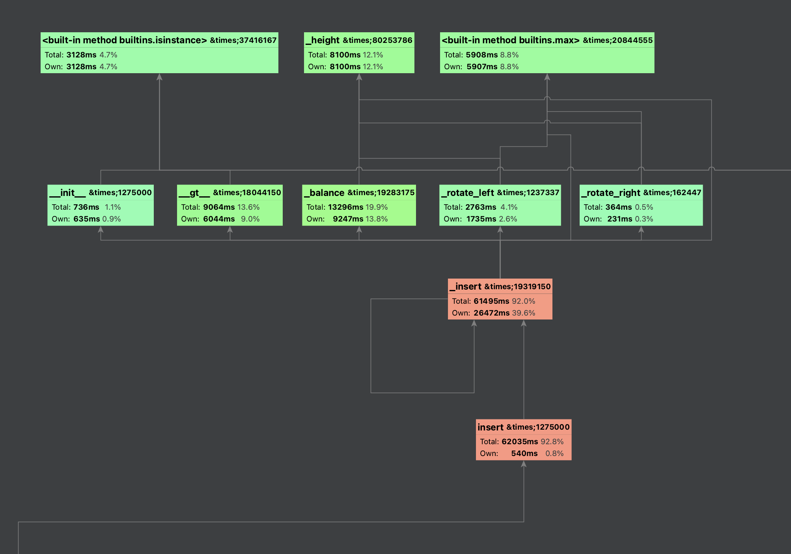

# PRJCTR Homework 23: Profiling

The task was to profile space usage and time-consuming 
for already implemented BSTree operations (insert, delete, search). 
Previously, I already did a time-consuming profiling to prove that 
BSTree's operations has `O(n log n)` at worst using only `time` module
and `seaborn` plots. 

## Prerequisites

* Installed [python](https://www.python.org/downloads/)
* Installed required libs: `pip install -r requirements.txt`

## Results

### Scalene profiler

Firstly, I tried with [scalene](https://github.com/plasma-umass/scalene) lib.
Authors say it is one of the fastest python profiles which can catch 
both CPU and memory usages. In case of profiling data structures and 
other algorithms for Big-O, I don't see it useful.

To run this profiler you need to execute following command:

```bash
$ scalene bst.py
```

This will profile your code and save the record in different formats (html and json),
then it automatically opens a generated html report in browser.

Below you can see a report for 100 hundred experiments inserting 
from 1000 to 100000 elements incrementally:


Line by line report with time, memory, cpu stats:


As we do not have plots with exact time measurements 
and only a small one for general memory consumptions, we cannot make any 
conclusions with this report.

---

Then, I've tried [memory_profiler](https://github.com/pythonprofilers/memory_profiler) 
and [cProfile](https://docs.python.org/3/library/profile.html), the last one is 
a built-in python profiler.

### Memory profiler

With `memory_profile` we can see from the plots a time consumption during experiments.
And the fact that it is increasing linearly relative to growth of the number of 
inserted elements.

To run this profile you need to execute following command:

```bash
$ mprof run python bst.py
```

This will create a new file with `*.dat` extension. To plot 
this results you need to execute this command in terminal:

```bash
$ mprof plot
```

This plots the last `*.dat` file results.

10 Experiments (from 1000 to 10000 inserted random elements):


20 Experiments (from 1000 to 20000 inserted random elements):


50 Experiments (from 1000 to 50000 inserted random elements):


50 worst-case experiments (from 1000 to 50000 inserted elements):


100 Experiments (from 1000 to 100000 inserted random elements):


Also, memory profile confirms that we do not have a memory leak
during our experiments because each of them has a 
line slope from 0.01 to 0.02 what is close to 0 and memory usage 
may be considered stable [link](https://github.com/pythonprofilers/memory_profiler#plot-settings). 

---

### cProfile

Built-in cProfile creates a cool call graph inside pyCharm.
It can be very useful for debugging production code for optimization.

Call graph for 50 experiments (from 1000 to 50000 elements):



Also, cprofile statistics confirm our estimations about time-consuming in BSTree 
operations:

Statistics for 50 experiments (from 1000 to 50000 elements):


Statistics for 10 experiments (from 1000 to 10000 elements):


---

### Previous setup with seaborn

Time consumption plots using my previous setup using `seaborn` plots. 
We see that it sticks to `n*log(n)` pattern and search operation much 
faster than insert and delete.

Inserting random elements:


Worst case inserting already sorted elements:


# PRJCTR Homework 19: Data structures and algorithms

This work shows the benefits of using self-balancing BST data structure. 
A python class was implemented with insert, search and delete operations, 
and other helpful methods for this BST. 
The complexity of this data structure was measured and worst case scenarios 
were also considered.

Integer counting sort was considered as sorting algorithm. 
The complexity of it was measured and worst case scenarios were also considered.

## Prerequisites

* Installed [python](https://www.python.org/downloads/)
* Installed required libs: `pip install -r requirements.txt`

## BST

Standard implementation of the BST with self-balancing using left/right 
rotations from [AVL trees](https://en.wikipedia.org/wiki/AVL_tree).

Usage:

```python
from bst import BST

tree = BST()

for i in range(10): tree.insert(i)

tree.height()  # >>> 4
tree.balance()  # >>> -1
tree.pretty_print()
# │           ┌── 9
# │       ┌── 8
# │   ┌── 7
# │   │   │   ┌── 6
# │   │   └── 5
# │   │       └── 4
# └── 3
#     │   ┌── 2
#     └── 1
#         └── 0

tree.search(6)  # >>> True
tree.search(16)  # >>> False

tree.delete(9)
tree.delete(8)
tree.delete(7)
tree.insert(17)
tree.insert(18)
tree.insert(19)

tree.pretty_print()
# │           ┌── 19
# │       ┌── 18
# │   ┌── 17
# │   │   │   ┌── 6
# │   │   └── 5
# │   │       └── 4
# └── 3
#     │   ┌── 2
#     └── 1
#         └── 0
```

The average and worst-case performances are `O(log(n))` for search, insert and delete operations.
The worst-case scenarios are happen when the values for insertion or deletion were sorted before 
(in ascending or descending order, it doesn't matter). 
In that cases, we have to re-balance our tree almost each time after insertion or deletion.
So the best performance when we have shuffled values before insertion.

### Results


As we could see our operations performance is getting worse with regard to `log(n)` function. 

## Counting sort

Standard implementation form the [wiki](https://en.wikipedia.org/wiki/Counting_sort#Pseudocode) pseudo-code.

Usage:

```python
from counting_sort import counting_sort

arr = [1, 10, 5, 6, 7, 9, 11, 10, 16, 19, 20, 21, 3, 6, 9]

counting_sort(arr, len(arr), max(arr)) 
# >>> [1, 3, 5, 6, 6, 7, 9, 9, 10, 10, 11, 16, 19, 20, 21]
```

Counting sort algorithm operates by counting the number of objects that possess distinct key values, 
and applying prefix sum on those counts to determine the positions of each key value in the output sequence.
Its running time is linear in the number of items and the difference between the maximum key value and the minimum key value, 
so it is only suitable for direct use in situations where the variation in keys is not significantly greater than the number of items.

Worst-case performance: `O(n+k)` where k is the range of the non-negative key values.

So it doesn't perform when we have a very long range of keys. 
And performs best with a huge amount of keys in a short range. 

### Results


As we could see that longer ranges (k parameters are bigger and dots are darker) 
are always higher than smaller ranges (k parameters are smaller and dots are lighter).
